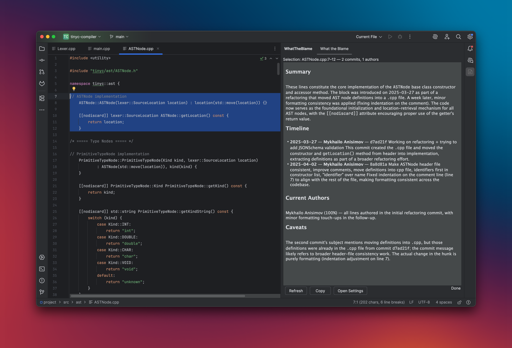
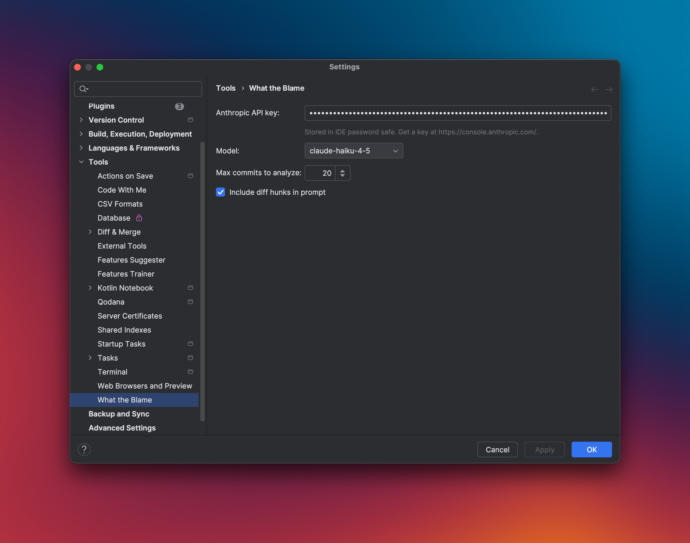

# What the Blame


> An IntelliJ IDEA plugin that turns `git blame` into a story.  
> Select code → right-click → **What the Blame?** → a narrative streams in explaining what those lines do, who shaped them, and *why* — grounded in commit messages and per-line git history.



<!-- Plugin description -->
**What the Blame** turns `git blame` into a story.

Select any range of code in the editor, right-click, and pick **What the Blame?**. A tool window opens and streams a narrative explaining what those lines do, who shaped them, when — and, most importantly, an inferred *why* — grounded in the commit messages, authors, and per-line diffs that actually touched the selection.

Under the hood the plugin runs `git log -L<a>,<b>:<file>` and `git blame` for the selected range, packages the commit/blame/hunk context into a cached prompt, and streams the response from the Anthropic API into a markdown panel.

**Features**

- Right-click action in the editor, console, and VCS popup menus
- Streaming markdown narration in a dedicated tool window
- Per-line authorship and commit history scoped to your exact selection — not the whole file
- Configurable model (Sonnet / Opus / Haiku), commit cap, and optional diff hunks in the prompt
- API key stored securely via the IDE's `PasswordSafe`
- Graceful error messages for missing key, invalid key, rate limiting, non-git files, and empty histories

**Setup:** open `Settings → Tools → What the Blame` and paste your Anthropic API key.
<!-- Plugin description end -->

## Usage



1. **Add your API key** — `Settings / Preferences → Tools → What the Blame → API Key`. Optionally choose a model (`claude-sonnet-4-6` by default), the maximum number of commits, and whether to include diff hunks in the prompt.
2. **Select code** — any range of lines in a file under git.
3. **Right-click → What the Blame?** — also available from the console popup and the VCS operations popup.
4. The **What the Blame** tool window opens on the right and streams the narrative as it is generated.

The action is hidden automatically when there is no active selection or the file is outside a git repository.

## How it works

```
selection
   │
   ▼
LineHistoryService  ── git log -L<a>,<b>:<file>  ──►  commits + per-commit hunks
                    ── git blame (FileAnnotation) ──►  per-line authors
   │
   ▼
BlamePromptBuilder  ── cacheable system prompt
                    ── user message: file + range + blame table + commits + hunks
   │
   ▼
AnthropicSdkClient  ── streaming Messages API  ──►  Flow<NarrationEvent>
   │
   ▼
WhatTheBlamePanel   ── flexmark → JEditorPane (re-rendered on each delta)
```

- Git work runs on `Dispatchers.IO`; the streaming flow keeps the EDT free.
- The system prompt is marked cacheable so repeated calls on the same project hit Anthropic's prompt cache.
- API keys are stored in the IDE's `PasswordSafe` — never in settings XML or plaintext.

## Building and running locally

```bash
./gradlew runIde    # launch a sandbox IDE with the plugin installed
./gradlew test      # run all tests
./gradlew build     # full build + distributable ZIP in build/distributions/
```

Requires JDK 21 (`jbr-21`). The first `runIde` will download IntelliJ IDEA Community 2025.1.1 automatically.

## Installing from a local build

```bash
./gradlew buildPlugin
```

Then in your IDE: `Plugins → ⚙ → Install plugin from disk…` and select the ZIP from `build/distributions/`.

---

Scaffolded from the [IntelliJ Platform Plugin Template][template].

[template]: https://github.com/JetBrains/intellij-platform-plugin-template
